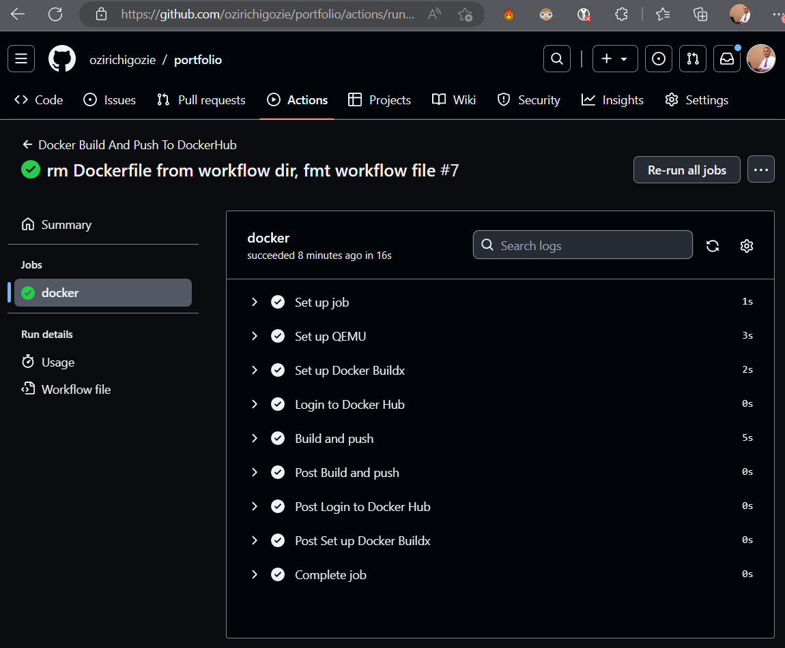
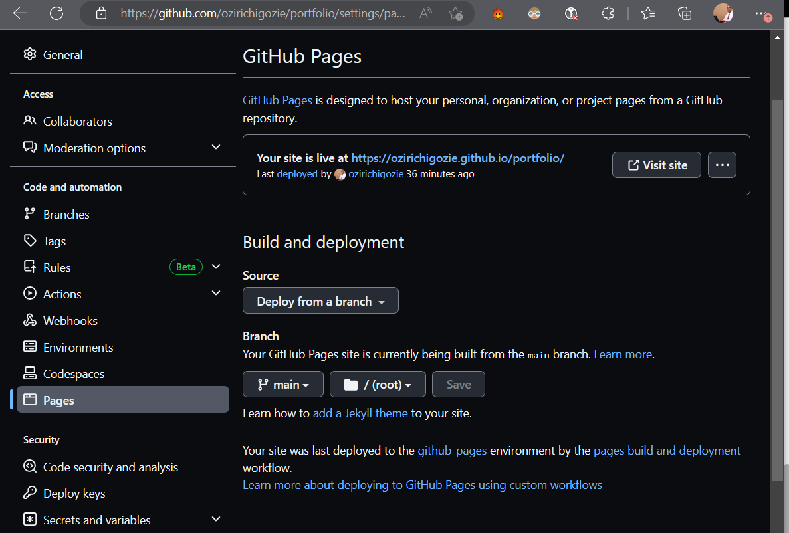

# <h1 align="center" style="color:steelblue; font-size:2.5rem; border:2px solid cyan; border-radius:5px; padding:10px; background-color:black">Basic CI/CD Workflow of a Docker-Containerized Portfolio Web Application</h1>


[](#github-page-build-and-deployment) [](./.github/workflows/docker-image.yml) [](#deployment-options) [](#) [](#) [](./index.html) [](./css/styles.css) [](js/scripts.js) [](#)

## Introduction
Welcome! 👋

This is a simple demo of the process of containerization of web applications using Docker. It is aimed at giving DevOps beginners a basic understanding of how to use `docker` and `docker-compose` to build Docker Images and push those images to a container registry - DockerHub.

I have used my personal portfolio website, which I created with a BOOTSTRAP template, to facilitate this demo. According to the configuration in my [Dockerfile](./Dockerfile) and [docker-compose.yml](./docker-compose.yml) file, this website will be served with NGINX:alpine, and the resulting Docker Image saved in DockerHub. 

Also, this repository uses a GitHub Action to automates a CI/CD workflow that will Build and Push the Docker Image of this web app to DockerHub. The deployment of the website in this repository is also automated using the GitHub Pages' Page and Deployment Action. You can preview the website [here](https://ozirichigozie.github.io/portfolio/).
>
> I would appreciate it if you submit a review of my work on the contact form (powered by [FormSubmit](https://www.formsubmit.co)) on the website.
> Find anything you would like to change or improve? Please leave a message 📧 or create a Pull Request.
> 🙏Please give this repo a STAR🌟 if you find its content helpful.
>

## Contents 📌
- [Introduction](#introduction)
- [Prerequisites](#prerequisites)
- [Deployment Options](#deployment-options)
- [Cleaning Up](#cleaning-up)
- [The GitHub Action Workflow](#the-github-action-workflow)
- [GitHub Page Build and Deployment](#github-page-build-and-deployment)

## Prerequisites 
To follow the deployment procedures explained in this repository you need to have 
- Docker and docker-compose installed on your workstation. You can get bash scripts for installing both [here](https://github.com/ozirichigozie/tools/blob/main/install-docker-on-ubuntu.sh).
- Basic knowledge on the Linux OS and the use of Docker commands.
- An account on [DockerHub](https://hub.docker.com) will also come in handy if you intend to activate the GitHub Action Workflow in this repository.

## 🚀Deployment Options 
The three deployment options here include:
1. [Docker Pull Using the Pre-existing Docker Image](#1-docker-pull)
2. [Docker Build Using the Dockerfile in this repository](#2-docker-build)
3. [Build and Run your Container with Docker-Compose](#3-docker-compose)

You may use any one of the following methods to deploy this application to your local server or virtual machine. After option 1 or 2, visit the website at your **IP_address:80 or localhost:80** if you are running it on your local machine. For option 3, this will be at **IP_address:8000 or localhost:8000.**

### 1. Docker Pull 
With the `docker pull` command, you can use the already built Docker Image of this demo from `docker.io/ozirichigozie/portfolio:latest` by running the commands below: 
 
```
docker pull ozirichigozie/portfolio:latest
docker run -d -p 80:80 ozirichigozie/portfolio
```
The `-p` flag maps port 80 on the host machine to port 80 on the container, while the `-d` flag ensures it runs in detached mode.

### 2. Docker Build
You can build the Image yourself directly from this public repository, and run it. Execute the following commands:

```
docker build https://github.com/ozirichigozie/portfolio.git#main
docker image ls
docker run -d -p 80:80 <image_id>
```

The `docker-build` command will find the [Dockerfile](./Dockerfile) present in this repository, and build a Docker Image with it.

### 3. Docker-Compose
To follow this option, ensure you have **docker-compose** installed along with Docker.
- First, clone this repository to your project's working directory (I have named mine "portfolio"). Run, `git clone https://github.com/ozirichigozie/portfolio.git portfolio`.
- Slide into the project's directory with `cd portfolio`.
- Within the project's working directory, run `docker-compose up -d`. The [docker-compose.yml](./docker-compose.yml) file within the project's directory will be identified and used to build and run a container.

## 🧹Cleaning up
If you intend to practise all three aforementioned options, ensure to delete the container and image from the previous option before going to the next. 
>
> <p style="color:red">⚠ Note: stop and remove containers first before removing the image they depend on.</p>
>
- ### ⏹Stop Containers 
To stop a container, run `docker ps` to get the `<CONTAINER ID>`, then run `docker stop <CONTAINER ID>` to stop it.
- ### ❌Remove Containers and Images
To remove a container, run `docker rm <CONTAINER ID>`. 

Run `docker images` to view the docker `<IMAGE ID>`, and `docker rmi <IMAGE ID>` to remove the image.
- ### When it's Docker-Compose:
If you used docker-compose, run `docker-compose down` in the project's working directory to stop and remove the container. Then `docker rmi <IMAGE ID>` to remove the docker image.
>

## The GitHub Action Workflow
The GitHub Action used in this repository ensures that on the event of any __Push__ of code updates or merged __Pull Request__ to this repository, the intended Docker Image is built and pushed to DockerHub (find more of this in the [GitHub Actions Marketplace](https://github.com/marketplace)). With this workflow, my Docker Image stays up to date anytime changes are made to this code repository.

### Secrets and Variables
The 'secrets' and 'vars' used in the [.github/workflows/docker-image.yml](.github/workflows/docker-image.yml) file have been provided by me at GitHub Actions 'Secret and Variables' Settings section as configuration values specifically for this repository only. You can find this by going to your project repository's **Settings > Secrets and Variables > Actions.** 

### Don't have a DOCKERHUB_TOKEN❔
Well, it's quite simple to create one. Login to your [DockerHub account](https://hub.docker.com) and go to **Account Settings > Security > New Access Token.** Give your access token at least **Read** & **Write** permissions, then copy and save it in a local file. Name the file with the same title you named your access token on DockerHub for the sake of easy remembrance. Note that you will NOT have access to this token again once you exit the window.

### Workflow Logs
After your workflow runs successfully, you can check the logs by clicking on the __Actions__ tab. These logs provide useful reports for debugging in case of errors.



Visit your DockerHub account to confirm the creation of your new Docker Image. Also note that whenever you trigger this workflow, a new Docker Image is not created, rather an update is made to the already existing one which was created at the first instance this workflow was executed.

## 🚀GitHub Page Build and Deployment
Don't know how to use GitHub Pages? GitHub Pages aids in hosting the pages from the GitHub repositories of developers or organizations. This facilitates the preview of webpages before they may be deployed to a production environment. Simply go to your project's repository's __Settings > Pages.__ Your website will usually be live at a URL that follows this pattern: `https://your_github_username.github.io/repository_name`. 

Ensure your homepage is situated in an `index.html` file located within the root folder of the main or master branch of your project's repository, else you may not find your site displayed at your GitHub Pages URL. I hope you find the snapshot below helpful.



##### 📚 Learn More
- [Docker and docker-compose](https://docs.docker.com)
- [GitHub Actions](https://docs.github.com/en/actions/guides)